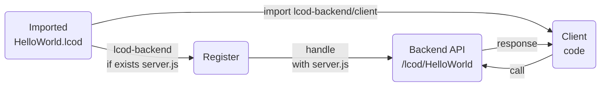

[](https://github.com/lcod-team/lcod-backend/actions/workflows/ci.yml)
[](LICENSE)

# lcod-backend

This project defines a [Svelte][1] [backend](https://github.com/sveltejs/svelte-preprocess/) for `.lcod` folders containing a `server.js` file.



## The server.js file

A `server.js` file can be defined in a `.lcod` component and it's used to define the backend code of the component, simply invoked by the `call` function.

## Usage

### Configuration

In your svelte project, edit the `vite.config.js` to declare the `lcod-backend`.

```js
import { sveltekit } from '@sveltejs/kit/vite';
import { defineConfig } from 'vitest/config';
import { lcodBackendConfig } from 'lcod-backend/config';

export default defineConfig({
	plugins: [sveltekit(), lcodBackendConfig()],
	test: {
		include: ['src/**/*.{test,spec}.{js,ts}']
	}
});
```

### MyComp.lcod/server.js

You have to `export default` a `function` that take one `data` object in argument and return a value. This function can be `async` and use `await`.

```js
import { error } from '@sveltejs/kit';

/**
 * @param {{ min: any; max: any; }} data
 */
export default function handle(data) {
	const min = Number(data.min ?? '0');
	const max = Number(data.max ?? '1');

	const d = max - min;

	if (isNaN(d) || d < 0) {
		throw error(400, 'min and max must be numbers, and min must be less than max');
	}

	const rnd = '' + Math.round(min + Math.random() * d);
	return { rnd };
}
```

### MyComp.lcod/Comp.svelte

```html
<script>
	import { onMount } from 'svelte';
	import { lcodName, call } from 'lcod-backend/client';

	let rnd = 'loading...';
	onMount(async () => {
		rnd = (await call({ min: 100, max: 200 })).rnd;
	});
</script>

<h1>{lcodName} here {rnd}</h1>
```

## Motivation

Have [KISS](https://en.wikipedia.org/wiki/KISS_principle) piece of code to simplify the sharing of `front + back` in a `.lcod` component.
Generating [Svelte][1] code allows to have benefits of all its avantages: fast and light compilation, `HMR` development and allows many `CSR`/`SSR` configurations.

[1]: https://svelte.dev/
